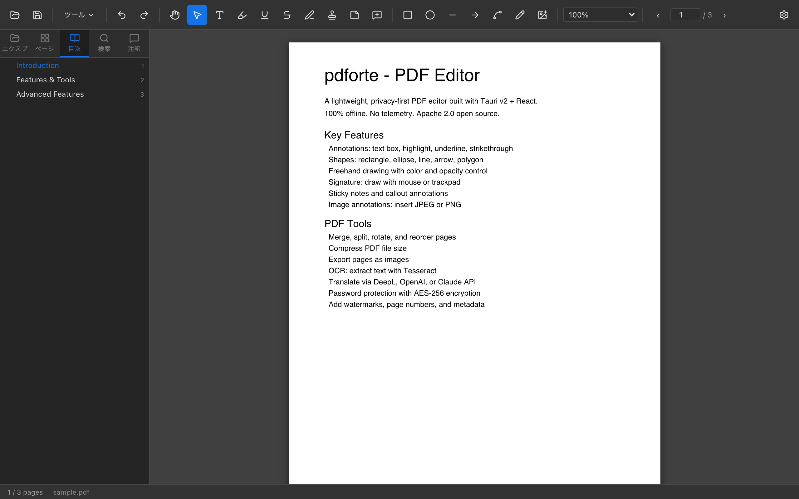
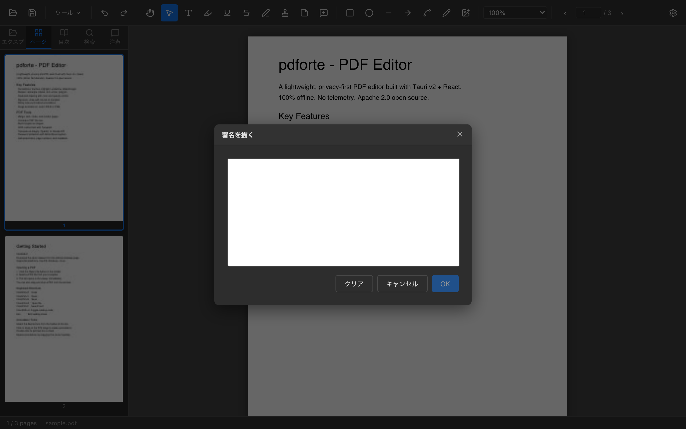

# pdforte

[日本語](README_ja.md) | [中文](README_zh.md)

A fast, lightweight PDF viewer and editor built with Tauri v2, React, and PDF.js.

<p align="center">
  
</p>

## Screenshots

<table>
  <tr>
    <td align="center" width="50%">
      <br>
      <sub><b>PDF Viewer</b> — continuous scroll, thumbnail sidebar, zoom controls</sub>
    </td>
    <td align="center" width="50%">
      <br>
      <sub><b>Annotations</b> — text box, highlight, shape, and sticky note on a page</sub>
    </td>
  </tr>
  <tr>
    <td align="center">
      <br>
      <sub><b>Text Box</b> — inline format toolbar with font, size, color, bold/italic</sub>
    </td>
    <td align="center">
      <br>
      <sub><b>Bookmark Panel</b> — PDF outline tree with expand/collapse and page navigation</sub>
    </td>
  </tr>
  <tr>
    <td align="center">
      <br>
      <sub><b>AI Translation</b> — translate pages via DeepL, OpenAI, or Claude API</sub>
    </td>
    <td align="center">
      <br>
      <sub><b>Signature</b> — draw and embed a signature with mouse or trackpad</sub>
    </td>
  </tr>
</table>

## Why pdforte?

| | pdforte | Adobe Acrobat | Smallpdf / PDF24 | Stirling PDF | Electron apps |
|---|---|---|---|---|---|
| **Price** | Free / Open source | Expensive subscription | Freemium / subscription | Free (self-hosted) | Varies |
| **Privacy** | 100% offline | Cloud sync | Files uploaded to cloud | Self-hosted | Varies |
| **Binary size** | ~5–15 MB | ~2 GB | Web app | Docker image | ~150 MB |
| **Memory** | ~50 MB | ~500 MB | N/A | N/A | ~200 MB |
| **CJK fonts** | Built-in (Noto) | Built-in | Limited | Limited | Limited |
| **Offline OCR** | Tesseract | ✓ | ✗ | ✓ | Rare |
| **AI translation** | ✓ (DeepL/GPT/Claude) | ✗ | ✗ | ✗ | ✗ |
| **Native app** | ✓ (Tauri) | ✓ | ✗ | ✗ | Partial |

**Key advantages over alternatives:**
- **Zero subscription** — Apache 2.0 open source, no paywalls
- **Privacy-first** — PDFs never leave your machine; no telemetry
- **Tiny footprint** — 10× smaller than Electron, 100× smaller than Acrobat
- **CJK-native** — Noto CJK fonts bundled; Japanese/Chinese/Korean text boxes render and bake correctly
- **All-in-one** — replaces specialized tools: Acrobat (annotations/security), Smallpdf (compress/merge/split), Stirling PDF (page ops), LibreOffice-dependent converters
- **AI-powered** — built-in translation via DeepL, OpenAI, or Claude API

## Features

### Viewing
- High-quality PDF rendering via PDF.js (HiDPI / Retina support)
- Continuous scroll with lazy page loading
- Zoom (50% – 500%), fit-width, fit-page
- Keyboard navigation (arrow keys, Page Up/Down)
- Page thumbnail sidebar — accent-highlighted current page, auto-scroll; **drag to reorder pages**
- Bookmark / outline panel — expand/collapse tree, current-page indicator
- Full-text search with previous/next navigation
- **Inline find bar** — Ctrl+F / Cmd+F opens a floating search bar; Enter/Shift+Enter to navigate, Esc to close

### Annotations
- **Text box** — drag to place, resize, edit inline (CJK font support)
  - Inline format toolbar: font family, size, text color, background color, bold, italic
- **Highlight / Underline / Strikethrough** — select text, apply color
- **Shapes** — rectangle, ellipse, line, arrow, polygon (right-click to close)
- **Freehand drawing** — pencil tool with configurable color, width, and opacity
- **Image annotation** — insert JPEG/PNG onto page, resize with handles
- **Signature** — draw with mouse/trackpad
- **Stamp** — insert image as stamp with opacity control
- **Sticky Note** — click icon to expand/collapse popup note
- **Callout** — text box with draggable arrow pointing to target position
- **Comments** — right-click any annotation → "Edit comment" to attach a text note; previewed in the annotation list
- **Right-click context menu** — right-click selected text to copy; right-click annotation to delete or edit comment
- **Undo / Redo** — Ctrl+Z / Ctrl+Y (unlimited history)
- **Annotation list panel** — sidebar tab showing all annotations with comment previews, click to navigate
- **Property panel** — edit color, size, opacity for selected annotation
- **Export / Import** — save and restore annotations as `.annot` JSON files

### Editing
- Existing text editing (overlay mode)
- Page reorder / delete (drag-and-drop in Page Order dialog or drag thumbnails directly)
- Page rotation (90° CW/CCW per page)
- Merge multiple PDFs
- Split PDF by page ranges
- Blank page insertion
- **Watermark** — diagonal text watermark with custom font, color, opacity, rotation
- **Header / Footer** — add page numbers or custom text at 6 positions (`{n}`, `{total}` macros)

### Conversion & Export
- PDF → Word (.docx) / Excel (.xlsx) / PowerPoint (.pptx) via LibreOffice
- PDF → JPEG / PNG (per page export)
- **Save as Text** — extract full PDF text and save as .txt
- Word / Excel / PowerPoint → PDF via LibreOffice
- Image (JPEG/PNG) → PDF
- **Create PDF** — build PDF from images (JPEG/PNG) or plain text
- **PDF Scanner** — select images, reorder, convert to PDF (A4/Letter/original size)

### OCR
- **Text extraction** — run Tesseract OCR on selected pages, export as .txt
- **Add text layer** — make scanned PDFs searchable via Tesseract PDF output mode

### AI Tools
- **PDF Translation** — Translate pages via DeepL, OpenAI, or Claude API.
  Extracted text blocks are placed as TextBox annotations at their original positions.
- Target languages: Japanese, English, Chinese, Korean, German, French, Spanish, Italian, Portuguese

### Security
- **Open encrypted PDFs** — password dialog prompts automatically; shows retry hint on wrong password
- Password protection (user + owner password, AES-256 via qpdf)
- Print / copy restrictions
- **Remove password** — decrypt a password-protected PDF and save a clean copy
- **Flatten PDF** — bake all annotations into page content; remove editable layer
- **PDF Sanitize** — remove JavaScript, OpenAction, embedded files, metadata
- **Signature verification** — display signature field info (AcroForm /Sig fields)
- **Metadata editor** — read and edit title, author, subject, keywords, creator, producer

### Other
- Print dialog with page range, paper size (A4/A3/Letter/Legal), and orientation
- Drag & drop PDF onto the window to open
- Recent files list (Acrobat-style home screen)
- **Reading mode** — hide toolbar and sidebar for distraction-free reading (Ctrl+Shift+H; Esc to exit)
- Adobe Acrobat-inspired dark UI with file/edit/view/window menus
- **10 languages**: Japanese, English, Simplified Chinese, Traditional Chinese, Korean, Italian, French, German, Spanish, Portuguese
- File explorer sidebar (VS Code-style)

## Why Tauri?

| | pdforte (Tauri) | Electron |
|---|---|---|
| Binary size | ~5–15 MB | ~150 MB |
| Memory | ~50 MB | ~200 MB |
| WebView | OS native | Bundled Chromium |

## Requirements

- **Node.js** 18+
- **Rust** 1.70+
- [Tauri v2 prerequisites](https://tauri.app/start/prerequisites/)

Optional:
- **LibreOffice** — for Office ↔ PDF conversion
  `brew install --cask libreoffice` (macOS) / `sudo apt install libreoffice` (Ubuntu)
- **Tesseract** — for OCR and text layer generation
  `brew install tesseract tesseract-lang` / `sudo apt install tesseract-ocr`
- **qpdf** — for PDF password protection
  `brew install qpdf` / `sudo apt install qpdf`

## Installation

### macOS

Download `pdforte-macos.zip` from [Releases](https://github.com/kent-tokyo/pdforte/releases), unzip, and move `pdforte.app` to `/Applications`.

> **"pdforte.app is damaged" error on macOS Sequoia / Ventura**
>
> This happens because the app is not notarized with Apple (requires a paid Developer account).
> Run this once in Terminal to remove the quarantine flag, then open normally:
> ```bash
> xattr -cr /Applications/pdforte.app
> ```
> Alternatively, right-click the `.app` → **Open** → **Open** to bypass Gatekeeper once.

### Windows

Download `pdforte-setup.exe` (installer) or `pdforte-portable-windows.zip` (no install needed) from Releases.

## Build from Source

```bash
git clone https://github.com/your-org/pdforte.git
cd pdforte
npm install
npm run tauri build
```

Development server:
```bash
npm run tauri dev
```

## Configuration

Settings are stored at `~/.config/pdforte/settings.json`:

```json
{
  "language": "ja",
  "theme": "dark",
  "translationEngine": "deepl",
  "translationApiKey": "YOUR_API_KEY",
  "defaultZoom": 1.0
}
```

Open the settings UI via the Settings button in the toolbar.

## AI Translation

1. Open a PDF
2. Go to **Tools menu → Translate PDF**
3. Select target language and page range
4. Enter your API key in Settings if not already set
5. Click **Start Translation**

Translation results are inserted as TextBox annotations overlaying the original text positions.
Supported engines: **DeepL**, **OpenAI GPT-4o-mini**, **Claude Haiku**.

## PDF Scanner

1. Go to **Tools menu → PDF Scanner**
2. Add images (JPEG/PNG) with the **+ Add Images** button
3. Reorder images with the ↑↓ buttons
4. Choose paper size (original / A4 / Letter)
5. Click **Create PDF** and choose save location

## Annotation Export / Import

Annotations can be exported to a `.annot` JSON file and imported back:
- Open the **Annotations** sidebar tab
- Use the **↑** (export) and **↓** (import) buttons at the top of the panel

## License

Apache 2.0 — see [LICENSE](LICENSE).

Attribution: [PDF.js](https://mozilla.github.io/pdf.js/) (Apache 2.0), [Noto Fonts](https://fonts.google.com/noto) (SIL OFL 1.1)
