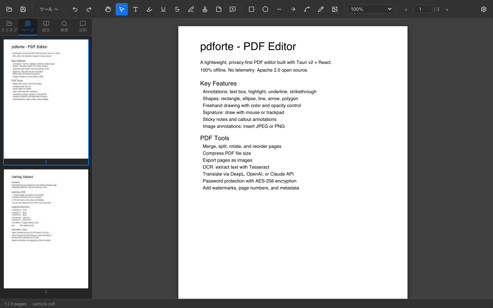
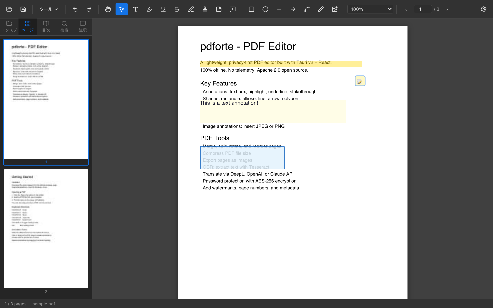
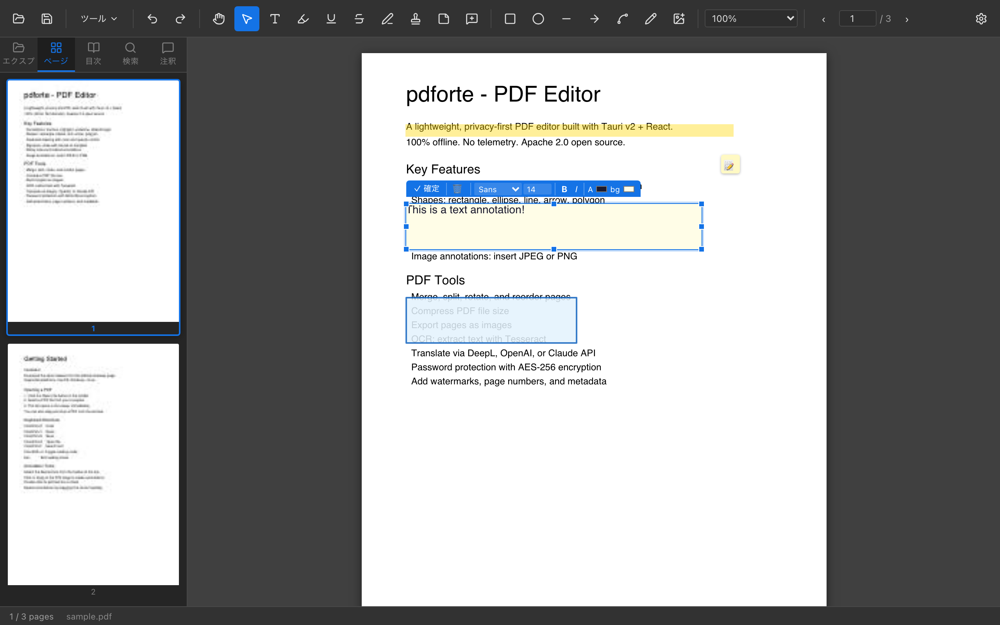
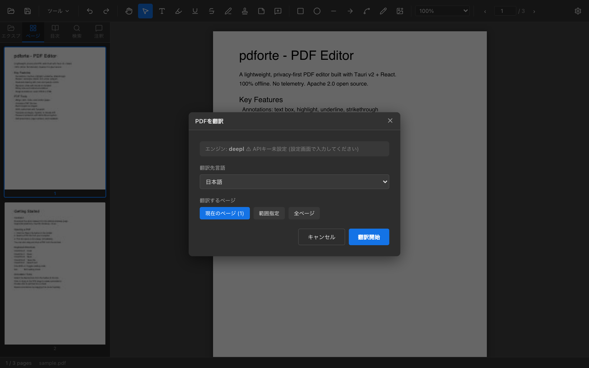

# pdforte

[English](README.md) | [日本語](README_ja.md)

快速、轻量的 PDF 查看器与编辑器，基于 Tauri v2 + React + PDF.js 构建。

<p align="center">
  
</p>

## 截图

<table>
  <tr>
    <td align="center" width="50%">
      <br>
      <sub><b>PDF 查看器</b> — 连续滚动、缩略图侧边栏、缩放控制</sub>
    </td>
    <td align="center" width="50%">
      <br>
      <sub><b>注释</b> — 文本框、高亮、图形、便签叠加在页面上</sub>
    </td>
  </tr>
  <tr>
    <td align="center">
      <br>
      <sub><b>文本框</b> — 内联格式工具栏，支持字体、大小、颜色、粗体/斜体</sub>
    </td>
    <td align="center">
      <br>
      <sub><b>AI 翻译</b> — 通过 DeepL、OpenAI 或 Claude API 翻译页面</sub>
    </td>
  </tr>
</table>

## 与竞品的比较

| | pdforte | Adobe Acrobat | Smallpdf / PDF24 | Stirling PDF | Electron 系应用 |
|---|---|---|---|---|---|
| **价格** | 免费 / 开源 | 高价订阅 | 免费增值/订阅 | 免费（自托管） | 不同 |
| **隐私** | 完全离线 | 云同步 | 文件上传至云端 | 自托管 | 不同 |
| **安装包大小** | ~5–15 MB | ~2 GB | Web 应用 | Docker 镜像 | ~150 MB |
| **内存占用** | ~50 MB | ~500 MB | N/A | N/A | ~200 MB |
| **CJK 字体** | 内置（Noto） | 内置 | 有限 | 有限 | 有限 |
| **离线 OCR** | Tesseract | ✓ | ✗ | ✓ | 少见 |
| **AI 翻译** | ✓（DeepL/GPT/Claude） | ✗ | ✗ | ✗ | ✗ |
| **原生应用** | ✓（Tauri） | ✓ | ✗ | ✗ | 部分 |

**核心优势：**
- **零订阅** — Apache 2.0 开源，无付费墙
- **隐私优先** — PDF 文件不离开本机，无遥测
- **极小体积** — 比 Electron 小 10 倍，比 Acrobat 小 100 倍
- **CJK 原生支持** — 内置 Noto CJK 字体，日文、中文、韩文文本框可正确渲染和保存
- **一体化** — 替代 Acrobat（批注/安全）、Smallpdf（压缩/合并/分割）、Stirling PDF（页面操作）、LibreOffice 转换工具
- **内置 AI** — 支持 DeepL、OpenAI、Claude API 的 PDF 翻译功能

## 功能特性

### 查看与导航
- 通过 PDF.js 实现高质量渲染（支持 HiDPI / Retina）
- 连续滚动显示（懒加载，快速）
- 缩放 50%–500%、适合宽度、适合页面
- 键盘导航（方向键、Page Up/Down）
- 页面缩略图侧边栏（当前页高亮、自动滚动）— **可拖动缩略图调整页面顺序**
- 书签/目录面板（可展开/折叠树形，当前页指示）
- 全文搜索（带前后导航）
- **内联查找栏** — Ctrl+F / Cmd+F 打开浮动搜索栏，Enter/Shift+Enter 导航，Esc 关闭

### 批注与标注
- **文本框** — 拖放放置，可调整大小，内联编辑（支持 CJK 字体）
  - 内联格式工具栏：字体、大小、文字颜色、背景色、粗体、斜体
- **高亮 / 下划线 / 删除线** — 选择文字后应用
- **图形绘制** — 矩形、椭圆、直线、箭头、多边形（右键确定）
- **手绘** — 铅笔工具（可设置颜色、线宽、不透明度）
- **插入图片** — 将 JPEG/PNG 放置到页面，支持调整大小
- **签名** — 用鼠标/触控板手写签名
- **印章** — 以图片形式插入印章（可调整透明度）
- **便签（Sticky Note）** — 点击图标展开/折叠弹出便签
- **标注（Callout）** — 带可拖动箭头的文本框
- **批注评论** — 右键点击批注 → "编辑评论" 添加文字备注，在批注列表中预览显示
- **右键上下文菜单** — 右键选中文字可复制；右键批注可删除或编辑评论
- **撤销 / 重做** — Ctrl+Z / Ctrl+Y（无限次）
- **批注列表面板** — 侧边栏批注标签显示所有批注及评论预览，点击跳转
- **属性面板** — 编辑选中批注的颜色、大小、不透明度
- **批注导出/导入** — 以 `.annot` JSON 格式保存和恢复

### 编辑
- 现有文字编辑（叠加模式）
- 页面重排/删除（页面整理对话框或直接拖动缩略图）
- 页面旋转（每页 90° 旋转）
- 合并多个 PDF
- 按页面范围分割 PDF
- 插入空白页
- **添加水印** — 对角文字水印（可设置字体、颜色、不透明度、旋转角度）
- **添加页眉/页脚** — 在 6 个位置插入页码（支持 `{n}`、`{total}` 宏）

### 转换与导出
- PDF → Word (.docx) / Excel (.xlsx) / PowerPoint (.pptx)（通过 LibreOffice）
- PDF → JPEG / PNG（按页导出）
- **另存为文本** — 提取 PDF 全文并保存为 .txt
- Word / Excel / PowerPoint → PDF（通过 LibreOffice）
- 图片（JPEG/PNG）→ PDF
- **创建 PDF** — 从图片（JPEG/PNG）或纯文本生成新 PDF
- **PDF 扫描仪** — 选择图片、排序、转换为 PDF（A4/Letter/原始尺寸）

### OCR
- **文字提取** — 用 Tesseract 对指定页进行 OCR → 导出文本文件
- **添加文字层** — 让扫描版 PDF 可搜索（Tesseract PDF 输出模式）

### AI 工具
- **PDF 翻译** — 通过 DeepL / OpenAI / Claude API 翻译页面内容。文本块以 TextBox 批注的形式覆盖原始位置。
- 支持语言：日语、英语、中文、韩语、德语、法语、西班牙语、意大利语、葡萄牙语

### 安全
- **打开加密 PDF** — 自动弹出密码对话框，密码错误时提示重试
- 密码保护（用户/所有者密码，AES-256 via qpdf）
- 禁止打印/复制设置
- **移除密码** — 解密 PDF 并保存无密码副本
- **PDF 扁平化** — 将所有批注烘焙到页面内容，移除可编辑层
- **PDF 净化** — 移除 JavaScript、OpenAction、嵌入文件、元数据
- **签名验证** — 显示 AcroForm 签名字段信息
- **元数据编辑器** — 读取和编辑标题、作者、主题、关键词等

### 其他
- 打印对话框（页面范围、纸张大小 A4/A3/Letter/Legal、方向）
- 拖放 PDF 到窗口打开
- 最近文件列表（Acrobat 风格主屏幕）
- **阅读模式** — 隐藏工具栏和侧边栏，专注阅读（Ctrl+Shift+H / Esc 退出）
- Adobe Acrobat 风格菜单（文件/编辑/视图/窗口）
- **10 种语言**：日语、英语、简体中文、繁体中文、韩语、意大利语、法语、德语、西班牙语、葡萄牙语
- VS Code 风格的文件资源管理器侧边栏

## 为什么选择 Tauri？

| | pdforte (Tauri) | Electron |
|---|---|---|
| 安装包大小 | ~5–15 MB | ~150 MB |
| 内存占用 | ~50 MB | ~200 MB |
| WebView | 操作系统原生 | 捆绑 Chromium |

## 系统要求

- **Node.js** 18+
- **Rust** 1.70+
- [Tauri v2 前置条件](https://tauri.app/start/prerequisites/)

可选（用于对应功能）：
- **LibreOffice** — Office ↔ PDF 转换
  macOS: `brew install --cask libreoffice`
  Ubuntu: `sudo apt install libreoffice`
- **Tesseract** — OCR 和文字层生成
  macOS: `brew install tesseract tesseract-lang`
  Ubuntu: `sudo apt install tesseract-ocr`
- **qpdf** — PDF 密码保护
  macOS: `brew install qpdf`
  Ubuntu: `sudo apt install qpdf`

## 从源码构建

```bash
git clone https://github.com/your-org/pdforte.git
cd pdforte
npm install
npm run tauri build
```

开发服务器：
```bash
npm run tauri dev
```

## 配置

配置文件路径 `~/.config/pdforte/settings.json`：

```json
{
  "language": "zh-CN",
  "theme": "dark",
  "translationEngine": "deepl",
  "translationApiKey": "YOUR_API_KEY",
  "defaultZoom": 1.0
}
```

通过工具栏设置按钮打开设置界面。

## AI 翻译使用方法

1. 打开 PDF
2. 点击 **工具菜单 → PDF 翻译**
3. 选择目标语言和页面范围
4. 在设置中输入 API 密钥（如未设置）
5. 点击 **开始翻译**

翻译结果以 TextBox 批注的形式插入到原始文字位置。
支持引擎：**DeepL**、**OpenAI GPT-4o-mini**、**Claude Haiku**

## 批注导出/导入

打开侧边栏**批注**标签，使用顶部的 **↑**（导出）/ **↓**（导入）按钮。
格式为自定义的 `.annot` JSON 文件。

## 许可证

Apache 2.0 — 详见 [LICENSE](LICENSE)。

致谢：[PDF.js](https://mozilla.github.io/pdf.js/)（Apache 2.0）、[Noto Fonts](https://fonts.google.com/noto)（SIL OFL 1.1）
